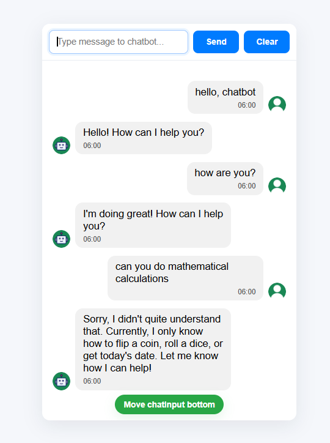
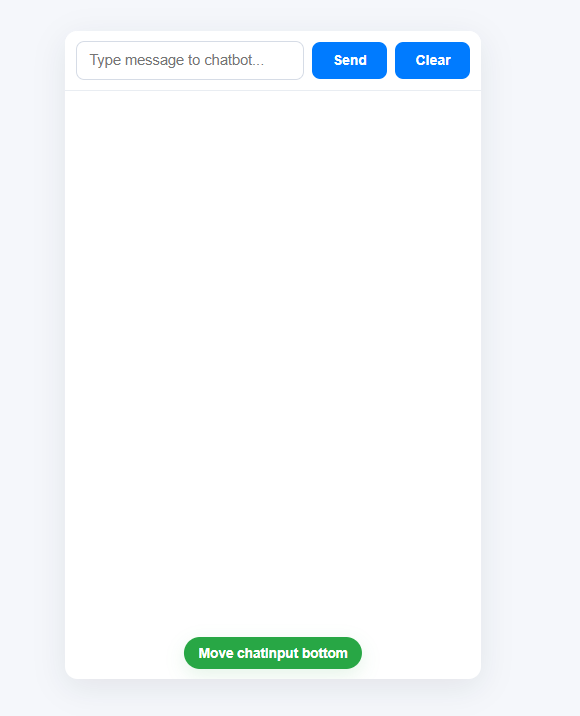
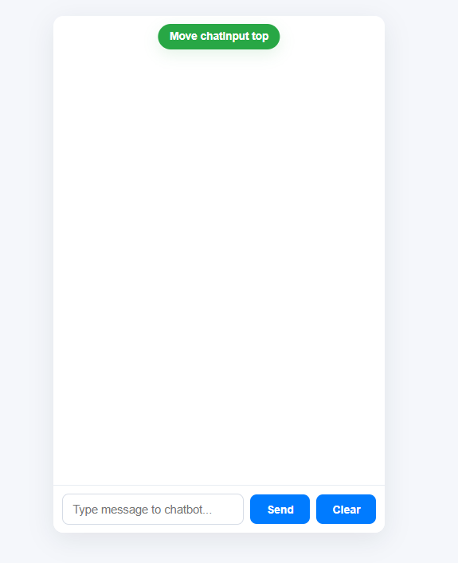
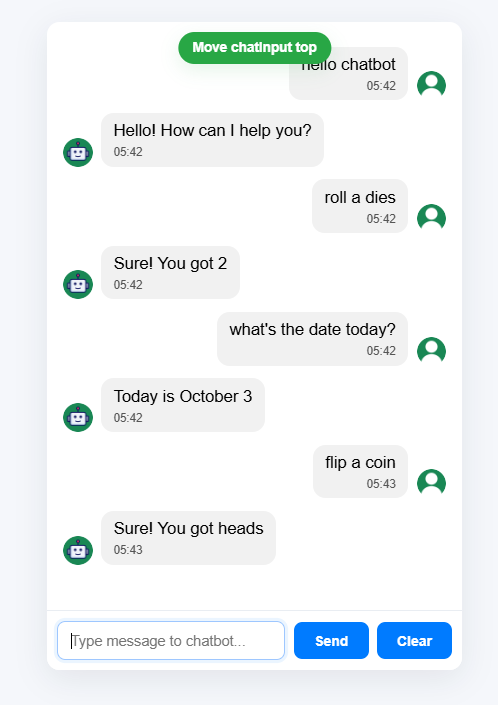

# Chatbot Web Application 🤖✨

<div align="center">


<br><br>

A modern and interactive chatbot web application built using **React.js** and **Vite**.
This chatbot performs fun and utility-based commands with a smooth and responsive user interface.

</div>

---

# 🌟 Features

<table>
<tr>
<td width="50%">

### 💬 Smart Chat Interface

* Interactive chatbot conversation flow
* Smooth message rendering
* User-friendly UI experience

### 🎲 Fun Commands

* Dice Roll Simulation
* Coin Flip Generator
* Randomized outputs

</td>

<td width="50%">

### 📅 Utility Commands

* Date query support
* Dynamic responses
* Real-time interaction

### ⚡ Performance

* Fast rendering with Vite
* Responsive layout
* Lightweight frontend architecture

</td>
</tr>
</table>

---

# 🛠️ Tech Stack

<div align="center">

| Technology    | Purpose                  |
| ------------- | ------------------------ |
| ⚛️ React.js   | Frontend Library         |
| ⚡ Vite        | Development & Build Tool |
| 🎨 CSS3       | Styling                  |
| 🧠 JavaScript | Logic & Functionality    |
| 🌐 HTML5      | Structure                |

</div>

---

# 📸 Project Preview

## 💬 Conversation Flow

<p align="center">
  
</p>

---

## 📥 Empty Chatbox (Bottom Input)

<p align="center">
  
</p>

---

## 📤 Empty Chatbox (Top Input)

<p align="center">
  
</p>

---

## 🎮 Demo Commands

<p align="center">
  
</p>

---

# 🚀 Getting Started

## 📦 Clone Repository

```bash
git clone https://github.com/ShubhamPanchal7/chatbot-project.git
```

---

## 📂 Navigate to Project

```bash
cd chatbot-project
```

---

## 📥 Install Dependencies

```bash
npm install
```

---

## ▶️ Run Development Server

```bash
npm run dev
```

---

# 🎯 Supported Commands

| Command      | Description                  |
| ------------ | ---------------------------- |
| 🎲 Roll Dice | Generates random dice number |
| 🪙 Flip Coin | Simulates coin toss          |
| 📅 Date      | Displays current date        |
| 👋 Greetings | Basic chatbot interaction    |

---

# 📈 Future Improvements

* 🤖 AI-powered responses
* 🌙 Dark mode support
* 🎤 Voice command integration
* 💾 Chat history storage
* 🔗 Backend & database integration

---

# 👨‍💻 Developer

<div align="center">

## Shubham Panchal

💻 Passionate Web Developer
🚀 Learning React, Full Stack Development & DSA

</div>

---

# ⭐ Support

If you like this project, consider giving it a ⭐ on GitHub!
